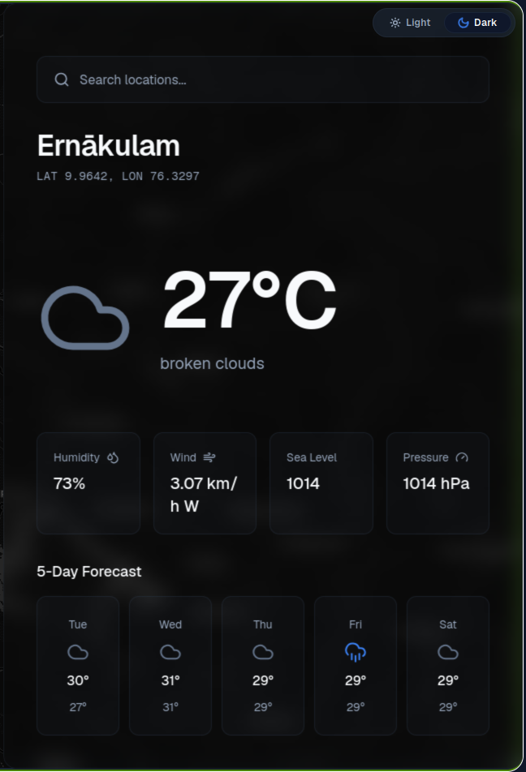

# 🌤️ Weather App

A modern and responsive weather application built with **Next.js, React, and TypeScript**. The application allows users to search for cities and view real-time weather information including temperature, weather conditions, humidity, wind speed, and more.

---

## 🚀 Live Demo

🔗 **Live Application:** [Add your live URL here](YOUR_LIVE_URL)

---

## 📸 Screenshots

### Home Page


### Weather Details



> Add your screenshots to the `screenshots` folder in the project root.

---

## ✨ Features

* 🌍 Search weather by city
* 🌡️ Display current temperature
* ☁️ Display current weather conditions
* 💧 Display humidity
* 💨 Display wind speed
* 🌅 Display additional weather information
* 🔍 Search weather by location
* ⏳ Loading state while fetching weather data
* ❌ Error handling for invalid locations
* 📱 Fully responsive design
* ⚡ Real-time weather information
* 🎨 Clean and user-friendly interface

---

## 🛠️ Tech Stack

### Frontend

* **Next.js**
* **React**
* **TypeScript**
* **HTML5**
* **CSS3**

### API

* Weather API

### Development Tools

* **Git**
* **GitHub**
* **npm**

---

## 📂 Project Structure

```text
weather-app/
│
├── public/
│   ├── images/
│   └── icons/
│
├── src/
│   ├── app/
│   │   ├── layout.tsx
│   │   ├── page.tsx
│   │   └── globals.css
│   │
│   ├── components/
│   │   ├── SearchBar.tsx
│   │   ├── WeatherCard.tsx
│   │   └── WeatherDetails.tsx
│   │
│   ├── services/
│   │   └── weatherService.ts
│   │
│   └── types/
│       └── weather.ts
│
├── screenshots/
│   ├── home.png
│   └── weather-details.png
│
├── .env.local
├── .gitignore
├── package.json
├── tsconfig.json
└── README.md
```

> The structure above is an example. Update it according to your actual project structure.

---

## ⚙️ Getting Started

Follow the steps below to run the project locally.

### Prerequisites

Make sure you have the following installed:

* Node.js
* npm
* Git

You can verify your installation with:

```bash
node -v
npm -v
git --version
```

---

## 📥 Installation

### 1. Clone the repository

```bash
git clone https://github.com/YOUR_USERNAME/YOUR_REPOSITORY.git
```

### 2. Navigate to the project directory

```bash
cd weather-app
```

### 3. Install dependencies

```bash
npm install
```

---

## 🔑 Environment Variables

Create a `.env.local` file in the root directory of the project.

```env
NEXT_PUBLIC_WEATHER_API_KEY=your_api_key_here
```

Replace:

```text
your_api_key_here
```

with your actual weather API key.

### Example

```env
NEXT_PUBLIC_WEATHER_API_KEY=xxxxxxxxxxxxxxxxxxxxxxxx
```

> ⚠️ **Important:** Never commit your `.env.local` file to GitHub if it contains a private API key or other sensitive credentials.

Make sure `.env.local` is included in your `.gitignore` file:

```text
.env*
```

---

## ▶️ Running the Development Server

Start the development server:

```bash
npm run dev
```

The application will be available at:

```text
http://localhost:3000
```

Open the URL in your browser to view the application.

---

## 🌦️ How the Application Works

The application follows a simple flow:

```text
┌─────────────────────┐
│    User enters      │
│       a city        │
└──────────┬──────────┘
           │
           ▼
┌─────────────────────┐
│   Search Request    │
└──────────┬──────────┘
           │
           ▼
┌─────────────────────┐
│    Weather API      │
└──────────┬──────────┘
           │
           ▼
┌─────────────────────┐
│    Weather Data     │
│      Response       │
└──────────┬──────────┘
           │
           ▼
┌─────────────────────┐
│  Process & Display  │
│    Weather Data     │
└─────────────────────┘
```

---

## 📡 API Integration

The application uses a weather API to retrieve real-time weather information.

The API request is made based on the city entered by the user.

Example:

```text
User Input:
London

        ↓

Weather API Request

        ↓

Weather Response

        ↓

Temperature
Humidity
Wind Speed
Weather Condition
```

The API response is then processed and displayed through reusable React components.

---

## 🧩 Main Components

### SearchBar

Responsible for:

* Accepting city input
* Handling user search
* Triggering the weather API request

### WeatherCard

Responsible for displaying:

* City name
* Temperature
* Weather condition
* Weather icon

### WeatherDetails

Responsible for displaying additional information such as:

* Humidity
* Wind speed
* Atmospheric pressure
* Visibility
* Other weather metrics

---

## 📱 Responsive Design

The application is designed to provide a good user experience across different screen sizes.

| Device      | Supported |
| ----------- | --------- |
| 🖥️ Desktop | ✅         |
| 💻 Laptop   | ✅         |
| 📱 Tablet   | ✅         |
| 📱 Mobile   | ✅         |

---

## ❌ Error Handling

The application handles common errors such as:

* Invalid city name
* City not found
* API request failure
* Network errors
* Missing weather data

Example:

```text
City not found.

Please enter a valid city name.
```

---

## ⏳ Loading State

While weather information is being retrieved from the API, the application displays a loading state.

```text
Searching for weather...
```

This provides feedback to the user while waiting for the API response.

---

## 🧠 What I Learned

This project helped me practice and understand several modern web development concepts:

* Next.js App Router
* React components
* TypeScript
* API integration
* Asynchronous JavaScript
* `async/await`
* Fetch API
* Error handling
* Loading states
* Environment variables
* Responsive UI development
* Component-based architecture
* Git and GitHub workflow

---

## 🔮 Future Improvements

The following features can be added in future versions:

* [ ] 📍 Detect user's current location
* [ ] 📅 7-day weather forecast
* [ ] 🌙 Dark mode
* [ ] ⭐ Favorite locations
* [ ] 🕒 Recent searches
* [ ] 🌡️ Celsius/Fahrenheit toggle
* [ ] 🌍 Multiple language support
* [ ] 📊 Weather charts
* [ ] 🌧️ Weather alerts
* [ ] 🗺️ Weather map
* [ ] 📱 Progressive Web App support

---

## 🏗️ Production Build

To create a production build:

```bash
npm run build
```

After the build completes successfully, start the production server:

```bash
npm start
```

The production application will be available at:

```text
http://localhost:3000
```

---

## 🧪 Testing

If tests are configured in the project, run:

```bash
npm test
```

For a specific test configuration, refer to the project's test documentation.

---

## 🚀 Deployment

This Next.js application can be deployed using platforms that support Next.js applications.

### Recommended

* Vercel
* Netlify
* Cloudflare
* Other Next.js-compatible hosting platforms

Before deploying, make sure the required environment variables are configured in your hosting provider.

---

## 🔐 Security

The following practices are recommended:

* Never commit `.env.local`
* Never expose private API keys
* Use environment variables for API credentials
* Validate user input
* Handle API errors gracefully

---

## 🤝 Contributing

Contributions are welcome!

If you would like to contribute to this project:

### 1. Fork the repository

Click the **Fork** button on GitHub.

### 2. Clone your fork

```bash
git clone https://github.com/YOUR_USERNAME/YOUR_REPOSITORY.git
```

### 3. Create a feature branch

```bash
git checkout -b feature/new-feature
```

### 4. Make your changes

Implement your feature or fix.

### 5. Commit your changes

```bash
git add .
git commit -m "Add new feature"
```

### 6. Push the branch

```bash
git push origin feature/new-feature
```

### 7. Create a Pull Request

Open a Pull Request on GitHub and describe your changes.

---

## 📄 License

This project is licensed under the **MIT License**.

See the `LICENSE` file for more information.

---

## 👨‍💻 Author

**Your Name**

### GitHub

🔗 [GitHub Profile](https://github.com/YOUR_USERNAME)

### LinkedIn

🔗 [LinkedIn Profile](YOUR_LINKEDIN_URL)

---

## ⭐ Support

If you found this project useful or interesting, please consider giving the repository a ⭐ on GitHub.

---

## 📬 Contact

If you have any questions, suggestions, or feedback, feel free to open an issue or contact me through GitHub.

---

**Built with ❤️ using Next.js, React, and TypeScript.**
